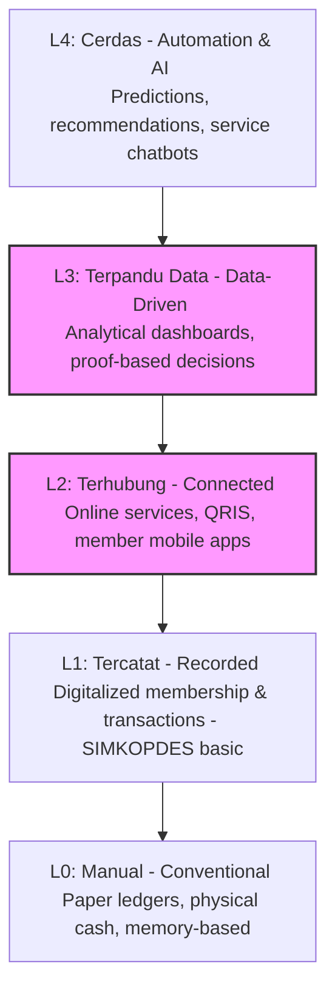

# North Star Cooperative Guide: Winning Strategy for Hackathon DCE 2026

This consolidated guide serves as our product development and pitching blueprint. It synthesizes the domain expertise, technical parameters, and strategic expectations shared by the 5 hackathon mentors and juries:
1. **Irwanda Wisnu Wardhana, SST, MPP, PhD** (Economic Policy Expert) - Sesi 1
2. **Irzan Raditya** (CEO & Co-Founder Kata.ai) - Sesi 6
3. **Nur Kholis** (Pusat Ekonomi & Bisnis Syariah FEB UI) - Sesi 3
4. **Rama Mamuaya** (CEO DailySocial.id) - Sesi 2.1
5. **Suci Sutjipto** (Digital Ecosystem & Policy Expert) - Sesi Mentorship

---

## 🎯 Executive Summary & The Grand Opportunity
Under **Inpres No. 9/2025**, the Indonesian government launched a national initiative to establish **Koperasi Desa/Kelurahan Merah Putih (KDKMP)**, backed by **Rp34.57 trillion** (representing 58% of the 2026 Village Funds). 

While **83,362 KDKMP** have already obtained legal status (*berbadan hukum*), only **1,061 units** are actually fully operating (*beroperasi penuh*) as of May/June 2026. Due to field constraints, the government cut the active operational target from 80,000 to **40,000 units**.

> [!IMPORTANT]
> **The Hackathon Sweet Spot (The 99% Gap):**
> We are not building a new cooperative. Our opportunity lies in **closing the gap between "having legal status" and "being fully operational."** The winning solution will drive adoption of existing platforms, not add unnecessary new apps.

---

## 👥 1. User-Centric Design: Designing for "Bu Sari"
We must build our solution specifically for the actual village cooperative administrator, exemplified by **Bu Sari**, rather than trying to impress the judges with over-engineered tech.

```
                  +-----------------------------------+
                  |          Bu Sari (47 y/o)         |
                  |     Treasurer & Trusted Leader    |
                  +-----------------+-----------------+
                                    |
            +-----------------------+-----------------------+
            |                       |                       |
            v                       v                       v
     [Device Limitation]     [Connectivity]          [User Interface]
     Rp1.5M Android Phone    Fluctuating Signal      Reluctant to install new apps
     Almost full storage     Conserving data quota   Master of WhatsApp / Books
```

### Design Constraints
* **Low-End Optimization:** The solution must run flawlessly on a Rp1.5 million Android phone with weak/unstable connectivity (2 bars of signal).
* **Familiar Channels:** Do not force users to install a new app. Meet them where they already are (e.g., **WhatsApp API**, lightweight web forms).
* **Colloquial Language:** Use simple, everyday Indonesian. Eliminate all technical, financial, or AI jargon.
* **Safe-to-Fail UI:** Ensure that accidental clicks or inputs never result in critical data loss.

### The 3 Pre-Development Questions
Before writing any code, we must answer:
1. **Is the problem real?** If our solution disappeared tomorrow, would anyone feel its absence?
2. **Who is the single primary user?** Put a name and face to them (e.g., Bu Sari). "All cooperative members" is too broad and indicates uncompleted validation.
3. **What is the moving metric?** Which single metric moves when our solution works (e.g., administrative hours saved, Rupiah volume transacted)?

---

## 🪜 2. The Modernization Ladder & Architectural Principles
We must align our product architecture with the national cooperative roadmap and existing government rails.

### The Modernization Ladder

* **Target Step:** Most cooperatives are currently at **L0–L1**. A realistic hackathon solution must bridge them from **L1 (Recorded) to L2–L3 (Connected & Data-Driven)**. 
* **Integration Rule:** Do not rebuild transaction ledgers or marketplaces from scratch. They are already provided by **SIMKOPDES Mobile** and **Coop Trade**. Connect to them via APIs.

### Policy & Compliance Frameworks
* **SPBE Alignment (Perpres 82/2023):** Build with open, interoperable data formats. Our solution must easily connect to national databases (Kemendagri, Bappenas, tax, Agrinas land data) rather than becoming a data silo.
* **UU PDP Compliance (UU No. 27/2022):** KDKMP manages highly sensitive data (NIKs, financial balances, family economic status). We must implement user consent mechanisms, data encryption, and transparent processing logs.

---

## 📊 3. Multidimensional Feasibility & Impact Modeling
KDKMPs are hybrid organizations balancing **Economic (Profit)** and **Social (Welfare)** mandates. Our business model must reflect both.

### The Four Essential Analyses
```
                       +-----------------------------+
                       |   KDKMP Multidimensional    |
                       |          Framework          |
                       +--------------+--------------+
                                      |
            +-------------------------+-------------------------+
            |                                                   |
            v                                                   v
   [Internal Viability]                                [Village Macro Ecosystem]
   - Financial Feasibility                             - Economic Feasibility (CBA)
   - Social Impact Analysis (SIA)                      - Economic Impact (Multiplier)
```

1. **Financial Feasibility (*Kelayakan Keuangan*):**
   * Prove internal business survival.
   * **Key Metrics:** Net Present Value ($NPV > 0$), Internal Rate of Return ($IRR > \text{Cost of Capital}$), Payback Period ($PP$), and Benefit-Cost Ratio ($BCR > 1$).
   * **IT Mitigation:** Build sensitivity models to simulate weather shocks (-20% crop volume), cost hikes (+15% fertilizer/raw material prices), and credit defaults (NPL up to 10% on savings & loans).
2. **Economic Feasibility (*Kelayakan Ekonomi* / CBA):**
   * Prove net benefits to the entire village ecosystem (e.g., cutting middleman margins, downstream processing values).
   * **Key Metrics:** Economic NPV ($ENPV > 0$), Economic IRR ($EIRR > \text{Social Discount Rate}$), and Economic BCR ($EBCR > 1$).
3. **Economic Impact (Multiplier Effect):**
   * **Direct:** Jobs created, fair crop pricing, SHU distribution.
   * **Indirect/Induced:** Backward linkages (local stores benefiting from cooperative construction), forward linkages (home industries using cooperative raw materials), and velocity of money circulating within the village.
4. **Social Impact Analysis (SIA):**
   * **Metrics:** Dropout rates reduced to zero (via cooperative scholarships), middleman dependency reduced, and minimum 30% representation of women and youth in management.

### Social Return on Investment (SROI) Formula
We must demonstrate the quantitative social value of our solution:

$$\text{SROI Ratio} = \frac{\text{Total Social Value Generated}}{\text{Total Investment Cost}}$$

$$\text{Social Value Generated} = \text{Number of People Impacted} \times \text{Size of Change} \times \text{Financial Proxy Value}$$

* *Example:* 50 cooperatives $\times$ 10 hours administrative time saved/month $\times$ Rp15,000/hour (local labor wage proxy) = Rp7,500,000 of social value created per month.

---

## 🤖 4. Technology Paradigm: Traditional vs. Agentic AI
We should leverage the shift from passive software to proactive agentic workflows to ease the administrative load of cooperative officers.

| Traditional Software | Agentic AI (Our Competitive Advantage) |
| :--- | :--- |
| **Passive:** Waits for human input (clicks, form fills, navigation). | **Proactive:** Executes goals autonomously from start to finish. |
| **Rigid:** Hardcoded if-else logic; slow and costly to customize. | **Adaptive:** Plan $\rightarrow$ Act $\rightarrow$ Evaluate loop using LLMs. |
| **High Friction:** Requires the user to learn the application. | **Conversational/Automated:** Accesses tools (WhatsApp, SIMKOPDES) directly. |

> [!TIP]
> **Strong MVP Concept:**
> Build a single, highly specialized Agentic AI designed to automate **one routine cooperative task** (e.g., "Remind all members of due loan payments via WhatsApp this week, compile responses, and present a recap for review") rather than a general-purpose dashboard. Always maintain a **human-in-the-loop** guardrail for financial or member decisions.

---

## 📣 5. The Pitching Strategy & Classic Traps
Jury scoring is heavily weighted toward strategic impact and validation.

### Jury Score Weights
* **1.5 - Strategic Impact:** Highest weight. Connect the solution to national priorities (economic independence, food security, downstreaming).
* **1.0 - Innovation & Novelty:** Uniqueness of the approach.
* **1.0 - Technical Feasibility (MVP):** A working prototype showing one complete flow.
* **0.5 - Team Quality:** Composition and implementation capability.

### 5 Classic Hackathon Traps to Avoid
1. **Solution Searching for a Problem:** Do not pitch an AI feature just because it is trendy. Validate the cooperative problem first.
2. **8 Features, 0 Completed:** One seamless, end-to-end user path beats eight half-finished features. Keep the scope tight.
3. **Ignoring Field Realities:** Never assume fast WiFi. Show how the solution operates on 2G/3G connections.
4. **100% Dummy Data:** Be honest about sample data. Disclose mockups during the pitch to build credibility.
5. **Vague Impact Statements:** Avoid phrases like "increases efficiency." Use specific numbers: "cuts daily record-keeping from 3 hours to 30 minutes, returning 2.5 hours/day to the administrator."

### 5-Minute Pitch Outline
```
  [0:00 - 1:00] -- Problem Statement (Tell the story of one real person, e.g., Bu Sari)
        |
  [1:00 - 3:00] -- Solution & Demo (Show the core flow end-to-end; do not just talk)
        |
  [3:00 - 5:00] -- Impact & Roadmap (Present NPV/SROI projections, first users, and a 90-day plan)
```
* **Q&A Rule:** During the 7-minute Q&A, answer honestly. Saying *"Belum tahu"* (We do not know yet) is better than fabricating a response.
