# Onboarding & Authentication Flow

## Data Model

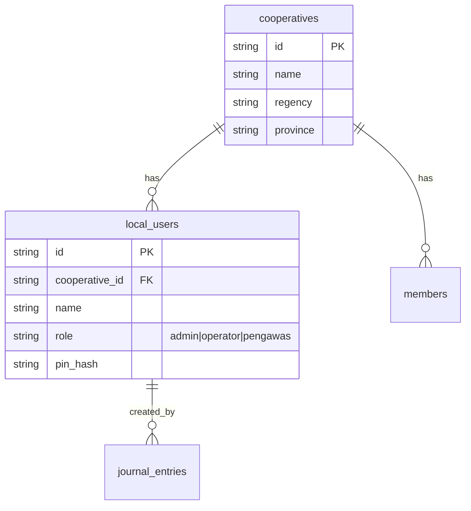

- **`cooperatives`** is the **tenant** — the unit of data isolation.
- **`local_users`** are **identities scoped to a cooperative** — users cannot exist without a parent cooperative.
- A person using two cooperatives has two separate `local_users` rows (one per cooperative), each with its own PIN.

---

## Core Flow

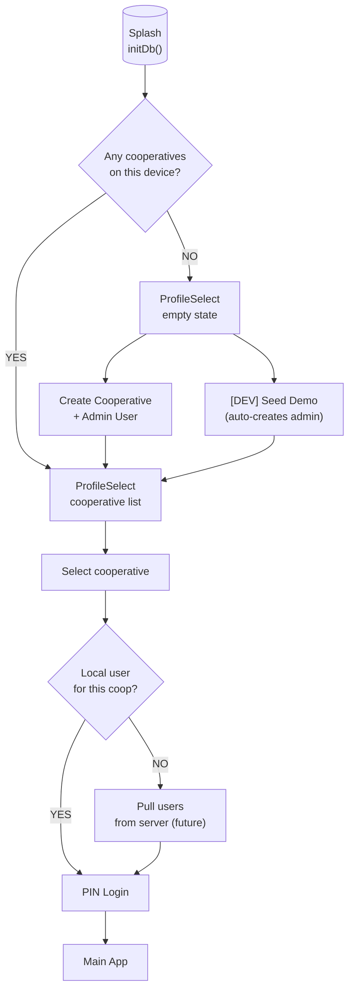

---

## Scenarios

### 1. Fresh Install (No Data)

```mermaid
sequenceDiagram
    actor U as User
    participant UI as ProfileSelect
    participant DB as SQLite

    U->>UI: Opens app for first time
    UI->>DB: initDb() — creates tables
    DB-->>UI: cooperatives table is empty
    UI->>U: Empty state: "No cooperatives yet"
    U->>UI: Clicks "Create Cooperative"

    rect rgb(15, 23, 42)
        Note over UI,DB: Cooperative form
        U->>UI: Fills: name, regency, province, etc.
        UI->>DB: INSERT INTO cooperatives
        DB-->>UI: ✅ "kdp-173xxxx"

        Note over UI,DB: Admin user form (same wizard)
        U->>UI: Fills: name, PIN
        UI->>UI: hash(PIN) → pin_hash
        UI->>DB: INSERT INTO local_users<br/>(cooperative_id = kdp-173xxxx,<br/>role = admin)
        DB-->>UI: ✅
    end

    UI->>U: Cooperative card appears in list
    U->>UI: Clicks cooperative card
    UI->>U: PIN Login screen
    U->>UI: Enters PIN
    UI->>DB: SELECT pin_hash FROM local_users<br/>WHERE cooperative_id = ?
    UI->>UI: verify(PIN, pin_hash)
    UI->>U: ✅ Main App
```

### 2. Returning User (Local Data Exists)

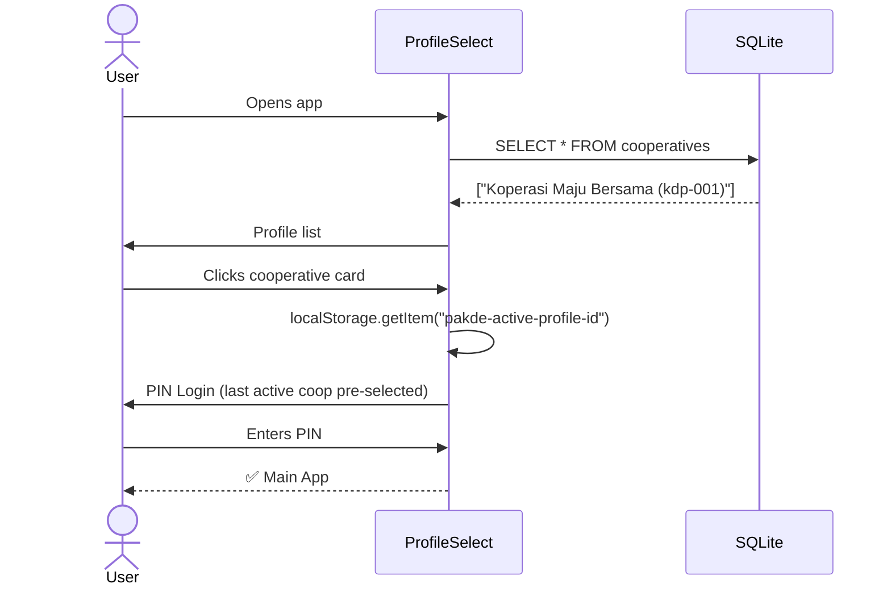

### 3. New User in Existing Cooperative

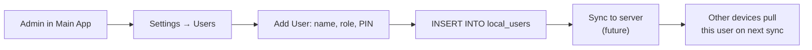

### 4. Manager Transition — Lost PIN, New Manager

**Context:** User U was the admin of cooperative C. User U is now gone (or lost their PIN). User V is the new manager of the exact same cooperative and needs access.

The cooperative row already exists in the DB with all its data (members, transactions, COA). The problem is: **User V cannot authenticate** because User U's PIN is unknown.

#### Path A — Recovery Question Works

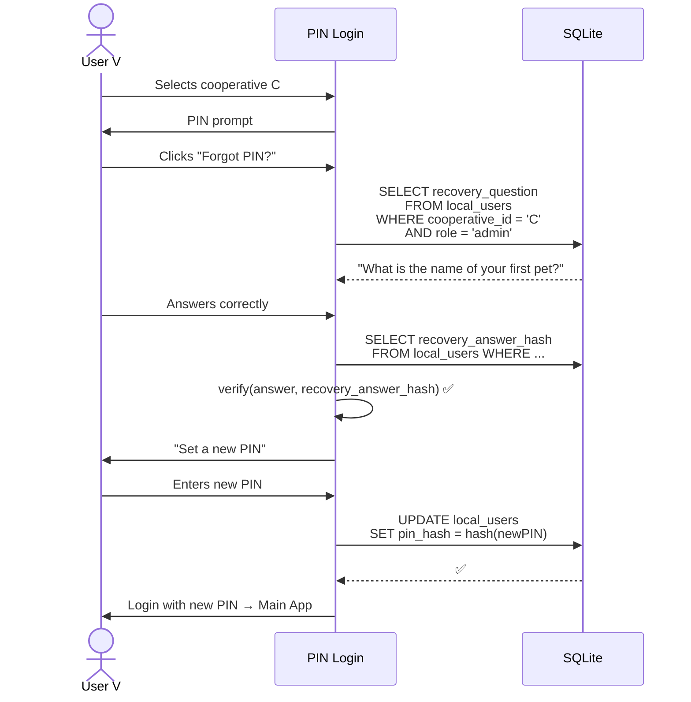

The schema already supports this: `local_users` has `recovery_question TEXT` and `recovery_answer_hash TEXT`. The admin sets these when creating their account.

#### Path B — Recovery Fails / No Recovery Set

User V doesn't know the answer, or User U never set a recovery question. User V has two options:

| Option | What happens | Data impact |
|---|---|---|
| **Re-register** | Delete the old `local_users` row for coop C, create a new one for User V as `admin` with a fresh PIN | ✅ Keeps all cooperative data (members, transactions, COA) — only replaces the identity row |
| **Start from scratch** | Delete the entire cooperative C and all its related data, then re-create it from the Create Cooperative wizard | ❌ Wipes members, transactions, journal entries, inventory — everything |

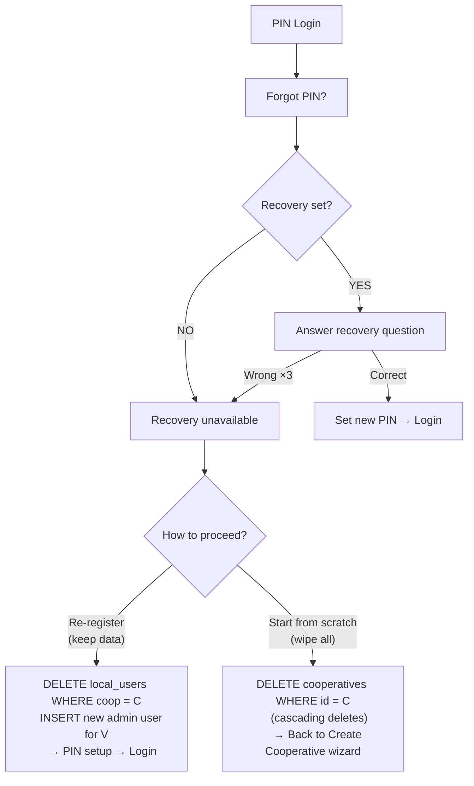

**Re-register** is the recommended path in most cases — it preserves the cooperative's history while granting access to the new manager. **Start from scratch** is the nuclear option for when the old data is irrelevant or corrupted.

#### Implementation Notes

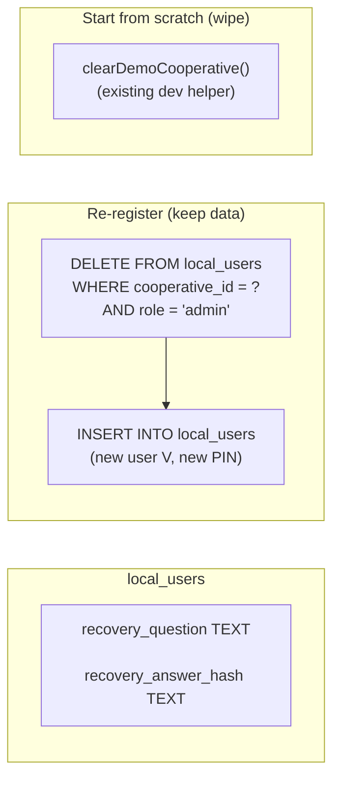

- **Recovery question** is set during admin creation (step 2 of the wizard) — optional, but strongly encouraged.
- **Re-register** is a one-click action on the PIN screen: "I'm the new manager. Let me in."
- **Start from scratch** reuses `clearDemoCooperative()` for now; in production, a general-purpose "factory reset this cooperative" function is needed.

---

### 5. Sync-Aware Identity: UUIDs & Managed Recovery

Once a cooperative is synced to the server, **identity is no longer device-local**. The server owns the truth about *who* can access *which* cooperative. Re-registering by deleting and re-inserting a `local_users` row locally will break on the next sync — the server still thinks User U is the admin and will either reject User V's writes or silently overwrite them.

#### Why UUIDs

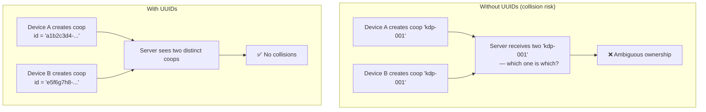

| Entity | Current ID format | Must become |
|---|---|---|
| `cooperatives.id` | `kdp-{timestamp}` | `uuid` |
| `local_users.id` | `usr-001` (hardcoded) | `uuid` |
| `members.id`, `categories.id`, etc. | mixed patterns | `uuid` |

UUIDs ensure that two devices can independently create records without colliding when they sync later. The server uses UUIDs as the authoritative key.

#### Managed Recovery Flow (with Server)

When User U syncs the cooperative and then disappears, User V cannot self-serve. The server is the gatekeeper.

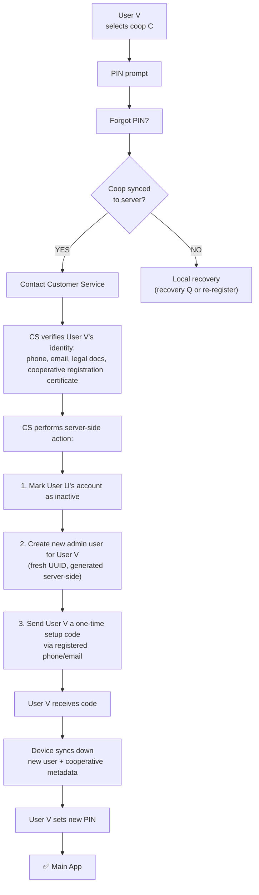

#### Why Not Self-Service?

Self-service manager transfer (e.g., "I'm the new manager — let me in") is a **social attack vector**. Anyone with physical access to the device could claim to be the new manager and take over the cooperative. The cooperative's bank account data, member NIK numbers, and financial records are inside.

Options for reducing CS burden while maintaining security:

| Approach | Security | CS effort | How |
|---|---|---|---|
| **CS-only recovery** | Highest | High | Manual identity verification |
| **Registered contact verification** | High | Low | SMS/email OTP to cooperative's registered phone/email on file |
| **Document upload + auto-review** | Medium-High | Medium | User V uploads SK Kemenkumham (legal decree); auto-matched against cooperative's legal_id |
| **Multi-admin quorum** | Medium | None | Requires 2-of-3 existing admins to approve the new manager |

The **registered contact verification** is the best balance: User V clicks "I'm the new manager" → server sends OTP to the cooperative's registered phone number (set during creation) → if User V can receive that SMS, they legitimately control the cooperative's contact channel → server creates new admin account.

#### Local vs. Synced Identity — Summary

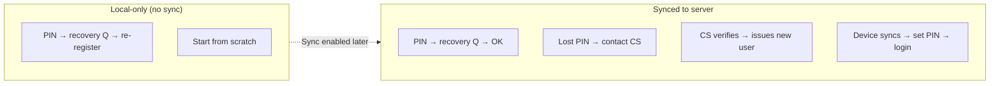

---

### 6. Pending: Online Sync Scenarios

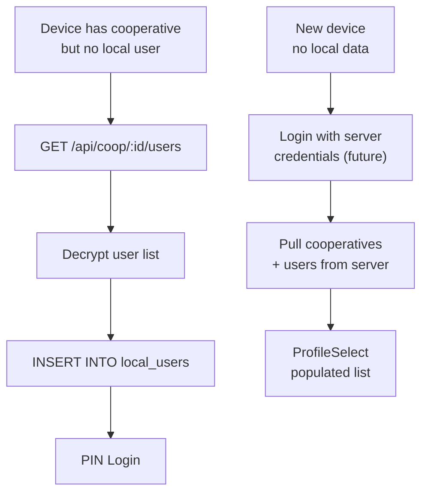

---

## Architecture Notes

| Principle | Implementation |
|---|---|
| **Cooperative always first** | `local_users.cooperative_id` is a FK to `cooperatives(id)` — enforced by schema |
| **UUIDs for all primary keys** | Required for sync; prevents ID collisions between devices; server uses UUIDs as authoritative key |
| **PIN per cooperative, per user** | Same person on two co-ops has two `local_users` rows with independent PINs |
| **Admin created with cooperative** | Wizard flow: coop form → user form (name, PIN, recovery Q) → single transaction |
| **Login scoped to cooperative** | PIN prompt queries `local_users WHERE cooperative_id = ?` |
| **Local recovery** | Recovery question → reset PIN (no server) |
| **Synced recovery** | Lost access → customer service verifies identity → issues new user UUID → device syncs down |
| **Server is identity authority** | Once synced, the server owns user→cooperative mapping; local re-register is blocked to prevent hijacking |
| **Current gap** | `currentUser` is hardcoded (`usr-001`, "Slamet Riyadi") — login is not yet wired; IDs are not UUIDs |
| **Sync will add** | Server-side cooperative + user registry; pull/migrate flows for new devices; managed recovery via CS |

---

## Comparison: Obsidian vs. PAKDE Identity Model

### How Obsidian Works

Obsidian is a **personal knowledge tool**. The user *is* the tenant.

| Layer | Obsidian's approach |
|---|---|
| **Data** | Plain markdown files in a local folder ("vault"). No database. No server. |
| **Identity** | Individual Obsidian account (email + password). One account = one person. |
| **Sync** | AES-256 end-to-end encrypted. User holds the encryption key. Obsidian cannot read your data. Sync is a paid add-on ($4-8/month). |
| **Recovery** | Standard email-based password reset. Account is tied to the person, not to any vault. |
| **Multi-device** | Link a new device by entering the vault's encryption password. Sync pulls down all files. |
| **Manager transition** | Does not exist. There is no "admin of a vault." The vault belongs to whoever holds the folder + encryption key. |

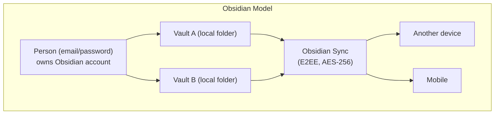

**Key insight:** Obsidian has no "tenant" concept because the person IS the boundary. Lost access? Reset your email password. New device? Enter encryption key. No cooperative, no roles, no manager transition problem.

### Why PAKDE Is Different

PAKDE is a **cooperative management tool**. The cooperative *is* the tenant — users are participants who come and go.

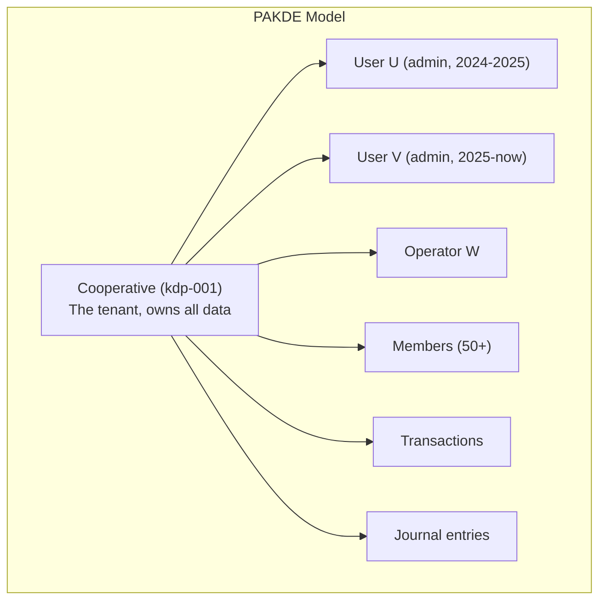

| Aspect | Obsidian | PAKDE |
|---|---|---|
| **Who owns the data?** | The individual user | The cooperative (legal entity) |
| **Does the owner outlive the person?** | No | Yes — cooperatives exist for decades, managers rotate |
| **Multi-user** | Single user per vault (shared vaults are recent bolt-on) | Multi-user by design (admin, operator, pengawas) |
| **Identity model** | Person → Account | Cooperative → Users (FK scoped to cooperative) |
| **"Forgot PIN"** | Email password reset | Recovery Q (local) or CS verification (synced) |
| **"New manager"** | N/A | Core workflow — must transfer admin without losing cooperative data |
| **Offline-first** | Full local vault, sync merges later | Full local SQLite, sync merges later |
| **Sync conflict model** | Per-file last-write-wins + version history | Per-row CRDT or last-write-wins (relational constraints make this harder) |
| **Encryption** | E2EE, user-managed key | TBD — must balance security with multi-user access |
| **Pricing** | $4-8/month per person (personal tool) | TBD — likely per-cooperative (organizational tool) |

### What PAKDE Can Learn from Obsidian

1. **Account is external, vault is local.** Obsidian separates "who you are" (account) from "what you have" (vault). PAKDE should similarly separate the *user identity service* from the *cooperative data*. The server authenticates the person; the local device holds the cooperative data.

2. **Encryption key as access control.** Obsidian uses an encryption key (derived from a password) to protect vaults. In PAKDE, the cooperative could have a "vault key" known to all authorized users. Losing all admins who know the key = data is unrecoverable. This is a feature, not a bug — it means even PAKDE's server cannot read cooperative financial data.

3. **Version history solves "who changed what."** Instead of complex conflict resolution, Obsidian keeps every version of every file. PAKDE could do the same: every `UPDATE` creates a `cooperative_audit` row with the old state, new state, user UUID, and timestamp. Sync becomes an append-only merge.

4. **"Start from scratch" is not an Obsidian concept.** You can delete a vault and create a new one, but there's no "I forgot my vault password, let me reset it" because the encryption key IS the access. If you lose the key, the data is gone. PAKDE should adopt this philosophy for synced cooperatives: the cooperative's admin(s) hold the keys. If all admins lose access, the cooperative must be re-created from scratch — the server cannot help.

### What PAKDE Can Learn from Figma

Figma is the canonical **offline-first, multi-user, structured-data sync** example. Unlike Obsidian's personal tool model, Figma supports multiple users editing the same document simultaneously — much closer to PAKDE's multi-user cooperative editing.

#### Figma's Sync Architecture

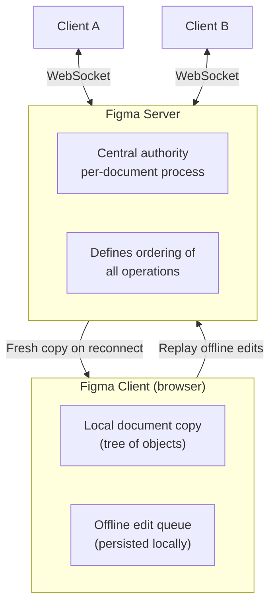

Key design decisions from [Figma's multiplayer blog post](https://www.figma.com/blog/how-figmas-multiplayer-technology-works/):

| Figma's choice | Why | PAKDE equivalent |
|---|---|---|
| **Property-level sync** | Each object's properties sync independently. Changing color on object A doesn't conflict with moving object B. | Each column in a row syncs independently. Changing member name doesn't conflict with updating member savings. |
| **Last-writer-wins per property** | No CRDT complexity. Server defines the order. Two edits to the same property → last one wins. | Same approach. Two users edit the same member's NIK → last writer wins. |
| **Client-generated IDs** | `<client_id>-<increment>` format. Works fully offline — no server roundtrip needed to create objects. | UUIDs. `crypto.randomUUID()` on the client. No collision risk. |
| **Server is central authority** | "Since Figma is centralized, we can simplify our system by removing CRDT overhead." | PAKDE server can also be the central ordering authority. Simplifies conflict resolution. |
| **Offline mode** | Go offline arbitrarily. On reconnect: download fresh document, reapply offline edits locally, then resume syncing. | Same model: download server state, reapply local changes, continue. |
| **Not true CRDTs** | CRDT-inspired but relaxed — CRDTs are designed for decentralized systems. Figma's central server eliminates the need for full CRDT guarantees. | Same. PAKDE has a server; it can define operation order. No need for full CRDT complexity. |

#### Figma's Document Model → PAKDE's Cooperative Model

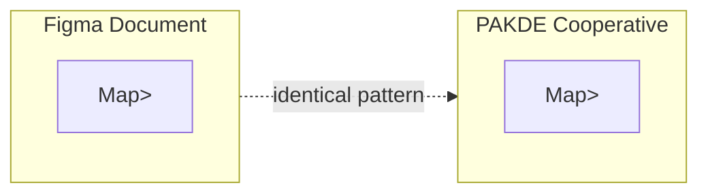

Figma treats a document as `Map<ObjectID, Map<Property, Value>>`. PAKDE can treat a cooperative as `Map<RowUUID, Map<Column, Value>>`. Every row in every table is independently syncable. This is the same model Replicache uses.

#### Replicache: The General-Purpose Framework

[Replicache](https://replicache.dev) (now open-source) is a client-side sync framework that generalizes Figma's approach:

| Replicache concept | PAKDE implementation |
|---|---|
| **Client-side cache** | SQLite database on device |
| **Optimistic mutations** | All writes go to local DB first, then sync to server |
| **Server reconciliation** | Server defines operation order; conflicts resolved server-side |
| **Persistent offline queue** | Pending changes stored in local DB with status flags |
| **Schema migration handling** | `ensureColumn()` pattern already exists in `initDb()` |

Linear (the issue tracker), Productlane, and tldraw all use Replicache for offline-first multi-user sync.

### Recommended Identity Architecture for PAKDE

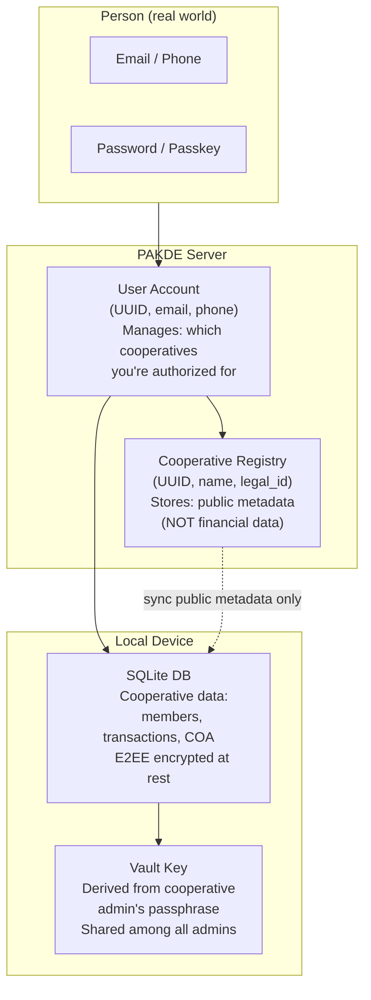

**The server never sees cooperative financial data.** It only knows:
- Which cooperatives exist (UUID, name, legal_id)
- Which user accounts are authorized for which cooperatives
- Sync metadata (version vectors, timestamps)

**The vault key** is the cooperative's encryption secret. It is:
- Generated when the cooperative is first created
- Shared to new admins via a secure channel (QR code, passphrase, or device-to-device transfer)
- Stored locally, never sent to the server
- If all key-holders are lost → data is permanently inaccessible → cooperative must start from scratch

This model eliminates the "customer service recovery" problem entirely: CS can verify identity and grant *account* access, but cannot decrypt cooperative data. The trade-off is higher responsibility on the cooperative to safeguard their vault key.

---

## To Build

### Phase 1 — Local-only (current)
1. **Merge admin creation into `CreateProfileDialog`** — add a second step: name, role `admin`, PIN setup, optional recovery question.
2. **Build PIN login screen** — sits between profile selection and main app; validates against `local_users.pin_hash`. Includes "Forgot PIN?" flow.
3. **Build re-register flow** — on PIN screen: "I'm the new manager" → confirm → delete old admin → create new admin → set PIN → login.
4. **Replace hardcoded `currentUser`** — derive from the authenticated `local_users` row.

### Phase 2 — Sync-ready
5. **Migrate all PKs to UUIDs** — cooperatives, users, members, categories, transactions, journal entries, COA accounts. Use `crypto.randomUUID()`.
6. **Separate identity from data** — `pakde_accounts` table (email, passkey) — independent of cooperative. Used only for cross-device sync authorization.
7. **Vault key system** — cooperative-level encryption key derived from admin passphrase. Stored locally. Shared to new admins via QR/passphrase. Never sent to server.
8. **Append-only audit log** — every `UPDATE`/`DELETE` writes to `cooperative_audit` (old_state, new_state, user_uuid, timestamp, device_id). Enables conflict-free sync merge.
9. **Server** — lightweight sync broker. Stores only: account registry, cooperative public metadata, encrypted sync payloads. Zero access to financial data.
